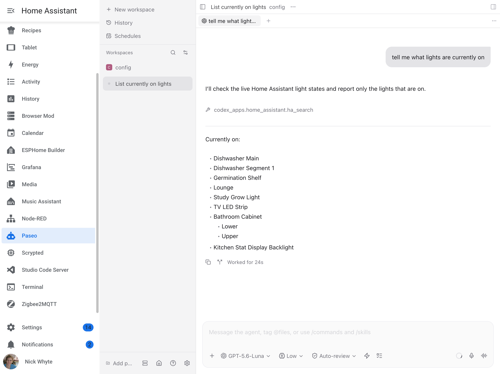

# Home Assistant Paseo

This add-on integrates the [Paseo Coding Agent Orchestrator](https://github.com/getpaseo/paseo) with Home Assistant. It adds the Paseo web user interface to the Home Assistant sidebar. Use this interface to interact with coding agents. The add-on runs the Paseo daemon in the container. The add-on uses `/config` as the initial project directory.

## Screenshot



## Features

- Adds an administrator-only panel to the Home Assistant sidebar.
- Serves the Paseo web user interface through Home Assistant ingress.
- Runs the Paseo daemon and the web user interface in the same container.
- Uses `/config` as the initial coding project.
- Stores Paseo state and sessions in the add-on data directory.
- Provides multiple coding-agent providers, GitHub CLI, and common shell tools.
- Supports Paseo remote-device pairing and encrypted relay access.
- Provides an option to start the Codex Remote Control daemon for native Codex clients.

The add-on does not publish a host port. Home Assistant ingress controls access to the sidebar. Paseo controls remote-device access.

## Install

1. Copy the repository URL: `https://github.com/nickw444/hass-paseo`.

2. In Home Assistant, go to **Settings** > **Apps**.
3. Select **Install app** to open the app store. Older Home Assistant versions call this **Add-on Store**.
4. Select the three-dot menu in the top-right corner.
5. Select **Repositories**.
6. Paste the repository URL into the repository field.
7. Select **Add**.
8. Find **Paseo** in the new repository.
9. Select **Install**.
10. Start the add-on.
11. Open the **Paseo** panel from the Home Assistant sidebar.

The add-on supports `amd64` and `aarch64`. The add-on registers `/config` as a Paseo project. The add-on data volume preserves Paseo state, provider settings, sessions, and pairings across restarts.

## Home Assistant MCP

`ha_mcp_url` is optional. Leave this option empty to disable Home Assistant MCP. Set this option to the endpoint provided by your MCP server. The add-on validates the URL at startup. The add-on does not print the URL in the logs.

For setup and feature details, see the [Home Assistant MCP Server documentation](https://www.home-assistant.io/integrations/mcp_server/) and the [Home Assistant MCP project documentation](https://homeassistant-ai.github.io/ha-mcp/).

## Documentation

See [`paseo/DOCS.md`](paseo/DOCS.md) for authentication boundaries, provider setup, remote-control configuration, MCP troubleshooting, recovery, and container tooling.

## Development

The repository includes the Paseo source as a Git submodule. Initialize the submodule before you run the local checks:

```bash
git submodule update --init --recursive
paseo/tests/test_static.sh
paseo/tests/test_ingress_rewrite.sh
```
